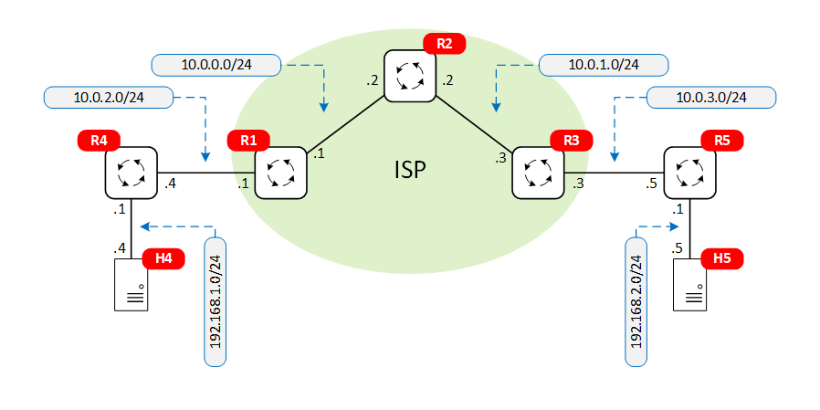

# MPLS networks implementation using FRRouting

This repository includes three MPLS implementations using [FRR](https://frrouting.org/) routers. The first lab sets the MPLS labels manually in three-router topology. In the second lab, the labels are distributed using LDP (Label Distribution Protocol) in three-router ISP network connecting two customer routers. The third lab uses Virtual Routing and Forwarding (VRF) and BGP to create L3 VPN tunnels across an ISP network.


## Requirements

To use this lab, you need to install [containerlab](https://containerlab.srlinux.dev/) (I used the [script method](https://containerlab.srlinux.dev/install/#install-script) Ubuntu 20.04 VM). You also need to have basic familiarity with [Docker](https://www.docker.com/).

Also make sure MPLS is enabled on the host machine (where containerlab is installed). See below.

For troubleshooting and traffic inspection, you may also install [Wireshark](https://www.wireshark.org/) and/or Tshark in the host machine/VM.

Finally, clone this repository to your host VM:

```
git clone https://github.com/martimy/clab_mpls_frr
```

### Enabling MPLS

To check if mpls is enabled on the host machine:

```
$ lsmod | grep mpls
mpls_gso               16384  0
mpls_iptunnel          20480  0
mpls_router            40960  1 mpls_iptunnel
ip_tunnel              24576  1 mpls_router
```

If you don't see the output above, load the modules and try again:

```
modprobe mpls_router
modprobe mpls_gso
modprobe mpls_iptunnel
```

To load the modules at boot time, add the following lines to /etc/modules-load.d/modules.conf:

```
cat >/etc/modules-load.d/modules.conf <<EOF
mpls_router
mpls_gso
mpls_iptunnel
EOF
```

Note also that MPLS needs to be enabled on each router. Therefore, lines similar to following are added to configuration of each router.

```
sysctl -w net.mpls.conf.lo.input=1
sysctl -w net.mpls.conf.eth1.input=1
sysctl -w net.mpls.platform_labels=1048575
```


## Lab1 - Manual labels

This lab represents a network topology of three routers and two hosts attached to the end routers. To establish connectivity between the end hosts, MPLS labels are pushed popped or swapped manually in each router.


Use the following command to start the lab:

```
cd mpls_frr_static
sudo clab deploy --topo mpls-frr-static.clab.yml
```

To end the lab:

```
sudo clab destroy --topo mpls-frr-static.clab.yml
```

To access the CLI of an FRR router:

```
docker exec -it clab-mpls_frr_ldp-r1 vtysh
```

To access a host:

```
docker exec -it clab-mpls_frr_ldp-host4 bash
```


### Try this

1. Test end-to-end connectivity between the two hosts:

    ```
    docker exec -it clab-mpls_frr_static-host4 ping 192.168.2.5
    ```

2. Use tshark to inspect the MPLS labels at different interfaces (notice the use of network namespace):

    ```
    sudo ip netns exec clab-mpls_frr_static-r2 tshark -i eth1 -O ethernet
    ```

    The output should be similar to the following (notice the labels in each direction):

    ```
    Frame 19: 102 bytes on wire (816 bits), 102 bytes captured (816 bits) on interface eth1, id 0
    Ethernet II, Src: aa:c1:ab:58:60:3e (aa:c1:ab:58:60:3e), Dst: aa:c1:ab:3d:2d:9d (aa:c1:ab:3d:2d:9d)
    MultiProtocol Label Switching Header, Label: 200, Exp: 0, S: 1, TTL: 62
    Internet Protocol Version 4, Src: 192.168.1.4, Dst: 192.168.2.5
    Internet Control Message Protocol

    Frame 20: 102 bytes on wire (816 bits), 102 bytes captured (816 bits) on interface eth1, id 0
    Ethernet II, Src: aa:c1:ab:3d:2d:9d (aa:c1:ab:3d:2d:9d), Dst: aa:c1:ab:58:60:3e (aa:c1:ab:58:60:3e)
    MultiProtocol Label Switching Header, Label: 300, Exp: 0, S: 1, TTL: 63
    Internet Protocol Version 4, Src: 192.168.2.5, Dst: 192.168.1.4
    Internet Control Message Protocol
    ```

## Lab2 - LDP

This lab represents a network topology of three ISP routers connecting two customer routers, each connected to a singe host. To establish connectivity between the end hosts, LDP is used to dynamically assign MPLS labels. OSPF is used  among the ISP routers to advertise connected networks as well as static router to customer networks.



Use the following command to start the lab:

```
cd mpls_frr_ldp
sudo clab deploy --topo mpls-frr-ldp.clab.yml
```

To end the lab:

```
sudo clab destroy --topo mpls-frr-ldp.clab.yml
```

### Try this


1. Test end-to-end connectivity between the two hosts:

    ```
    docker exec -it clab-mpls_frr_static-host4 ping 192.168.2.5
    ```

2. Use tshark to inspect the traffic at different interfaces:

    ```
    sudo ip netns exec clab-mpls_frr_ldp-r1 tshark -i eth1 -O ethernet
    ```

    Selected output (echo/echo reply):

    ```
    Frame 10: 102 bytes on wire (816 bits), 102 bytes captured (816 bits) on interface eth1, id 0
    Ethernet II, Src: aa:c1:ab:64:e5:a0 (aa:c1:ab:64:e5:a0), Dst: aa:c1:ab:ac:67:1e (aa:c1:ab:ac:67:1e)
    MultiProtocol Label Switching Header, Label: 16, Exp: 0, S: 1, TTL: 61
    Internet Protocol Version 4, Src: 192.168.2.5, Dst: 192.168.1.4
    Internet Control Message Protocol

    Frame 11: 102 bytes on wire (816 bits), 102 bytes captured (816 bits) on interface eth1, id 0
    Ethernet II, Src: aa:c1:ab:ac:67:1e (aa:c1:ab:ac:67:1e), Dst: aa:c1:ab:64:e5:a0 (aa:c1:ab:64:e5:a0)
    MultiProtocol Label Switching Header, Label: 21, Exp: 0, S: 1, TTL: 62
    Internet Protocol Version 4, Src: 192.168.1.4, Dst: 192.168.2.5
    Internet Control Message Protocol
    ```

    Selected output (OSPF and LDP exchanges):

    ```
    Frame 15: 82 bytes on wire (656 bits), 82 bytes captured (656 bits) on interface eth1, id 0
    Ethernet II, Src: aa:c1:ab:ac:67:1e (aa:c1:ab:ac:67:1e), Dst: IPv4mcast_05 (01:00:5e:00:00:05)
    Internet Protocol Version 4, Src: 10.0.0.1, Dst: 224.0.0.5
    Open Shortest Path First

    Frame 16: 82 bytes on wire (656 bits), 82 bytes captured (656 bits) on interface eth1, id 0
    Ethernet II, Src: aa:c1:ab:64:e5:a0 (aa:c1:ab:64:e5:a0), Dst: IPv4mcast_05 (01:00:5e:00:00:05)
    Internet Protocol Version 4, Src: 10.0.0.2, Dst: 224.0.0.5
    Open Shortest Path First

    Frame 17: 84 bytes on wire (672 bits), 84 bytes captured (672 bits) on interface eth1, id 0
    Ethernet II, Src: aa:c1:ab:ac:67:1e (aa:c1:ab:ac:67:1e), Dst: IPv4mcast_02 (01:00:5e:00:00:02)
    Internet Protocol Version 4, Src: 10.0.0.1, Dst: 224.0.0.2
    User Datagram Protocol, Src Port: 646, Dst Port: 646
    Label Distribution Protocol
    ```

## Lab3 - VRF

This lab demonstrates how an ISP can connect two customers with an overlapping IP address space using VRFs.
<documentation to be completed>


Use the following command to start the lab:

```
cd mpls_frr_vrf
sudo clab deploy --topo mpls-frr-vrf.clab.yml
```

To end the lab:

```
sudo clab destroy --topo mpls-frr-vrf.clab.yml
```
